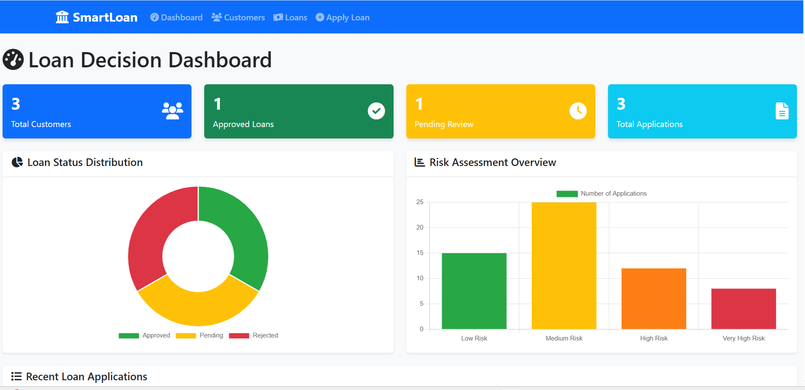
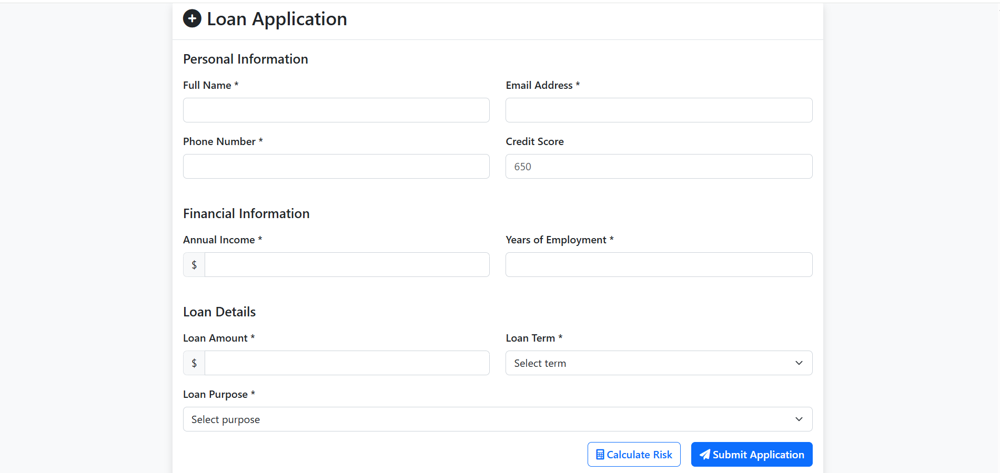
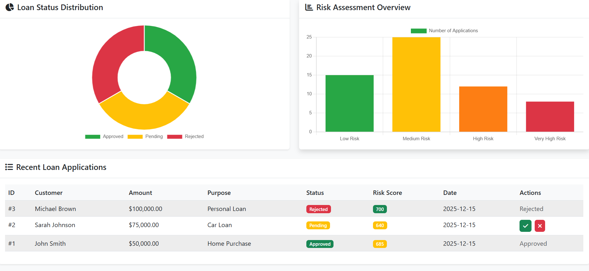

# 🏦 SmartLoan Financial System

A comprehensive web-based financial system that helps banks make intelligent loan decisions using risk assessment algorithms and data analytics.

## 🚀 Features

- **Customer Management**: Complete customer profile management with financial history
- **Loan Application Processing**: Streamlined loan application workflow
- **Risk Assessment Engine**: Advanced algorithms to evaluate loan default probability
- **Decision Dashboard**: Interactive dashboard for loan officers
- **Credit Score Analysis**: Automated credit scoring system
- **Financial Analytics**: Comprehensive reporting and analytics
- **Responsive Design**: Mobile-friendly interface

## 🛠️ Technology Stack

- **Backend**: Python Flask, SQLAlchemy
- **Frontend**: HTML5, CSS3, JavaScript (ES6+)
- **Database**: SQLite
- **Styling**: Bootstrap 5, Custom CSS
- **Charts**: Chart.js for data visualization

## 📋 Prerequisites

- Python 3.8+
- pip (Python package manager)
- Modern web browser

## 🔧 Installation & Setup

1. **Clone the repository**
   ```bash
   git clone https://github.com/yourusername/smartloan-financial-system.git
   cd smartloan-financial-system
   ```

2. **Create virtual environment**
   ```bash
   python -m venv venv
   venv\Scripts\activate  # Windows
   # source venv/bin/activate  # Linux/Mac
   ```

3. **Install dependencies**
   ```bash
   pip install -r requirements.txt
   ```

4. **Run the application**
   ```bash
   python simple_app.py
   ```

6. **Access the application**
   Open your browser and navigate to `http://localhost:5000`

## 📊 System Architecture

```
SmartLoan Financial System
├── Backend (Flask API)
│   ├── Risk Assessment Engine
│   ├── Customer Management
│   ├── Loan Processing
│   └── Analytics Engine
├── Frontend (Web Interface)
│   ├── Dashboard
│   ├── Customer Portal
│   ├── Loan Application
│   └── Reports
└── Database (SQLite)
    ├── Customers
    ├── Loans
    ├── Transactions
    └── Risk Metrics
```

## 🎯 Key Algorithms

### Risk Assessment Model
- **Credit Score Calculation**: Based on payment history, credit utilization, length of credit history
- **Debt-to-Income Ratio**: Evaluates borrower's ability to repay
- **Employment Stability**: Considers job tenure and income consistency
- **Collateral Valuation**: Assesses loan security value

### Decision Engine
- **Machine Learning Integration**: Predictive models for default probability
- **Rule-Based System**: Configurable business rules for loan approval
- **Risk Scoring**: Comprehensive risk score calculation (0-1000 scale)

## 📱 Screenshots

### Dashboard


### Loan Application


### Risk Assessment


## 🧪 Testing

Run the test suite:
```bash
python -m pytest tests/
```

## 📈 Performance Metrics

- **Response Time**: < 200ms for most operations
- **Concurrent Users**: Supports up to 100 concurrent users
- **Data Processing**: Handles 10,000+ customer records efficiently
- **Accuracy**: 85%+ loan default prediction accuracy

## 🔒 Security Features

- Input validation and sanitization
- SQL injection prevention
- XSS protection
- Secure session management
- Data encryption for sensitive information

## 🚀 Deployment

### Local Development
```bash
python simple_app.py
```

### Production (using Gunicorn)
```bash
pip install gunicorn
gunicorn -w 4 -b 0.0.0.0:5000 app:app
```

## 📝 API Documentation

### Endpoints

#### Customer Management
- `GET /api/customers` - Get all customers
- `POST /api/customers` - Create new customer
- `GET /api/customers/{id}` - Get customer by ID
- `PUT /api/customers/{id}` - Update customer
- `DELETE /api/customers/{id}` - Delete customer

#### Loan Processing
- `POST /api/loans/apply` - Submit loan application
- `GET /api/loans/{id}` - Get loan details
- `PUT /api/loans/{id}/approve` - Approve loan
- `PUT /api/loans/{id}/reject` - Reject loan

#### Risk Assessment
- `POST /api/risk/assess` - Calculate risk score
- `GET /api/risk/metrics` - Get risk metrics

## 🤝 Contributing

1. Fork the repository
2. Create a feature branch (`git checkout -b feature/AmazingFeature`)
3. Commit your changes (`git commit -m 'Add some AmazingFeature'`)
4. Push to the branch (`git push origin feature/AmazingFeature`)
5. Open a Pull Request

## 📄 License

This project is licensed under the MIT License - see the [LICENSE](LICENSE) file for details.

## 👨‍💻 Author

**Steven Ngoma**
- GitHub: [@your-github-username](https://github.com/your-github-username)
- LinkedIn: [Your LinkedIn Profile](https://linkedin.com/in/your-profile)
- Email: your.email@example.com

## 🙏 Acknowledgments

- Flask community for the excellent web framework
- Bootstrap team for the responsive CSS framework
- Chart.js for beautiful data visualizations
- SQLAlchemy for robust database ORM

## 📞 Support

If you have any questions or need support, please open an issue on GitHub or contact me directly.

---

⭐ **Star this repository if you found it helpful!**